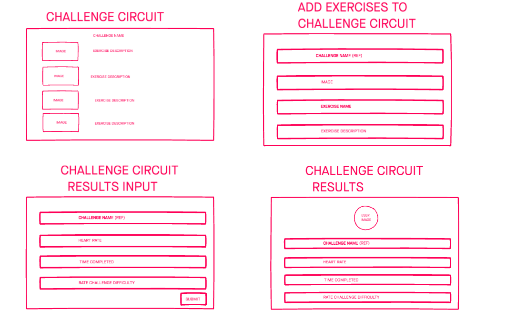

# Fitness Challenge App
### Django + React app

There are a lot of people with different brands of fitness watches and each brand has their own app. You can participate in a challenge with people of similar brand, but a common issue is looking for an app where you can engage in a challenge with your family and friends with other brand fitness watches.

This is a fitness challenge app where you can complete any challenge and 
also add your health stats for the completed challenges. You have the choice of joining an available challenge or creating your own. 
Anyone & Everyone can participate. 

### Behind the scenes:

This app was built using Django python web framework, postgresql database, and React for front end. 

1. ERD:

1. WireFrames:

1. Link to [Trello Board.](https://trello.com/b/Nt85csro/project-4-fitness-challenge-app)

1. Link to [Deployed Heroku App.](https://fitness-challenge-pr4.herokuapp.com/)